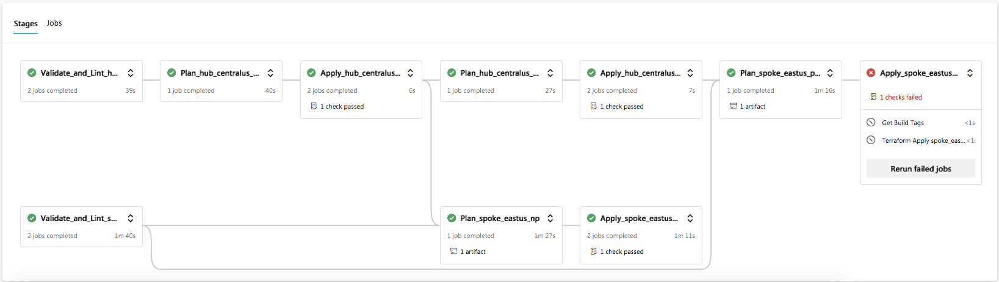
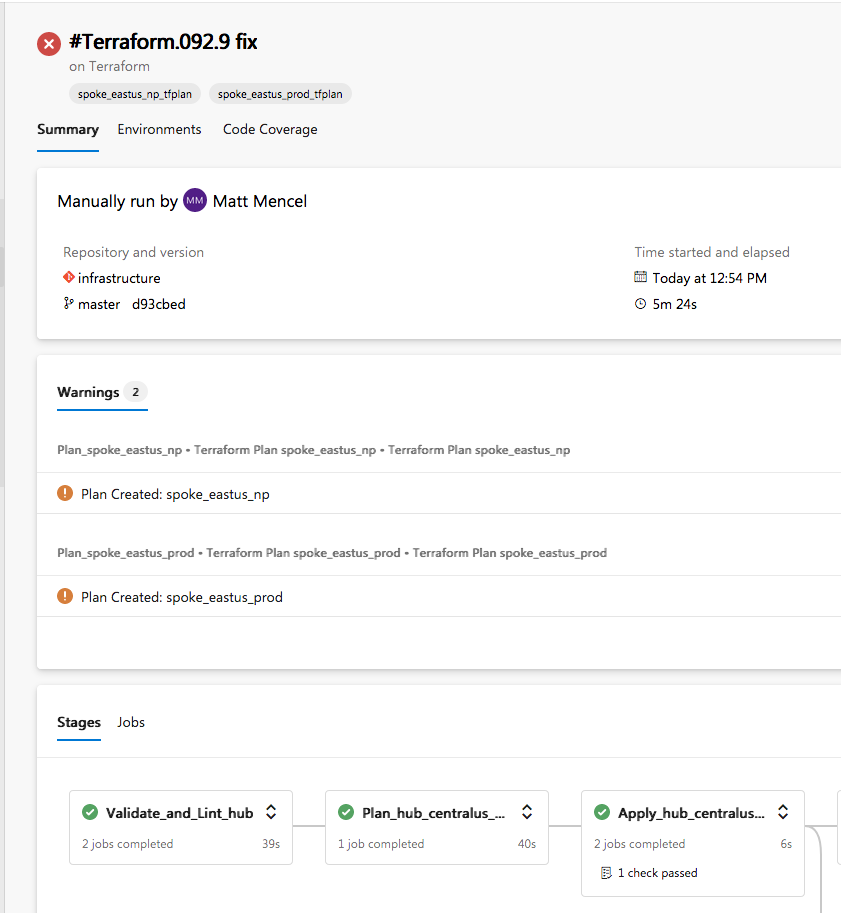

# Terraform Pipelines - Advanced

These pipelines take advantage of templates, parameters, and more advanced expressions to handle loops.

It was designed around a hub/spoke model that uses Terraform Workspaces to sub-divide environments/regions.

The example here is showing a simple dependency model for one hub/spoke with one workspace in each. More advanced dependency models are possible that could potentially have multiple hubs and spokes with multiple workspaces in each.

## Main File

The pipeline begins with `azure-pipelines.yml`.

### Variables

TF_VERSION: Terraform Version

STATE_STORAGE_ACCOUNT: The name of the storage account where STATE will be stored.

STATE_SUBSCRIPTION: Subscription where the state storage account resides.

### Stages

The `stages` section defines the list of stage templates that will be called.

#### Lint Template

For each hub/spoke, a list of workspace names is passed as parameters.

In the `lint.yml` template... 

For each state defined (e.g. hub/spoke) it will generate a separate Stage. 

Within each of those stages:

- It will loop over each workspace and run `terraform validate`
- It will run `tflint`

#### Plan Template

The Plan template is called twice, one for each subscription (NonProd and Prod in this example).

The parameters set the workspaces for hub and spoke, and whether the stage should have a `dependsOn` set for another workspace.

In the `plan.yml` template...

For each state defined (e.g. hub/spoke) it will generate a plan stage for each workspace in that state.

Within each of those stages:

- It sets a `dependsOn` to the appropriate Validate_and_Lint stage. 
- It will also set an additional `dependsOn` if it is specified in the parameters. In this example, the spoke Plan stage will depend on the Apply stage for it's hub. This ensures any requirements from hub are completed before the spoke attempts to plan.

- It runs a Terraform Plan.
  - If no changes are detected, the stage completes without creating any artifacts.
  - If an error occurs, the stage is marked as failed.
  - If changes are detected, an issue is logged to the AzDO pipeline  UI marking the changes, a Build Tag is generated on the pipeline, and the artifact is created.

#### Apply Template

The Apply template is called twice, one for each subscription (NonProd and Prod in this example).

The parameters set the workspaces for hub and spoke, and whether the stage should have a `dependsOn` set for another workspace.

In the `apply.yml` template...

For each state defined (e.g. hub/spoke) it will generate an apply stage for each workspace in that state.

Within each of those stages:

- It sets a `dependsOn` to the appropriate Plan stage. 
- It will also set an additional `dependsOn` if it is specified in the parameters. In this example, the spoke Apply stage will depend on the Apply stage for it's hub. This ensures any requirements from hub are completed before the spoke attempts to apply.

- It retrieves the Build Tags that have been created on this build to determine if a plan artifact was created. If no Build Tag is found for the workspace, the Apply deployment will be skipped. Otherwise...

- It runs a Terraform Apply

The Apply template takes advantage of Environments and Deployments so that Approval checks can be required before an Apply is allowed to continue.

## Notifications

Build tags and issue logging have been added to this pipeline example. You can see in this image, two tags have been added near the top, and two log notifications have been added under the Warnings section.

### Build Tags

The Build Tags are added to the build if a Terraform Plan generates changes and will create an artifact.

In the Apply stages, the existence of Build Tags are checked to determine if an Apply stage should be run or skipped.

### Issue Logs

An Issue Log is generated if a Terraform Plan generates changes and will create an artifact.

It creates a Warning log in the UI that when clicked on, drills straight through to the job log to show the plan output. This assists in finding the plans in the build logs.

